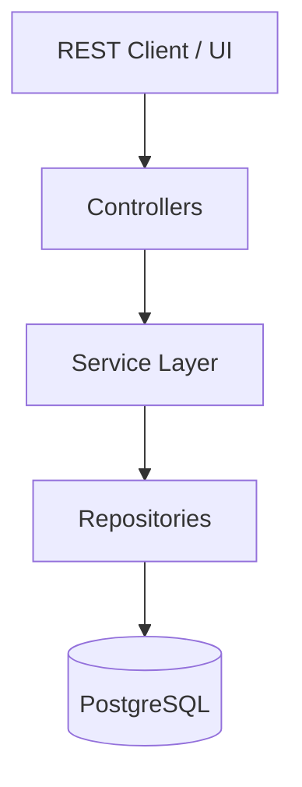
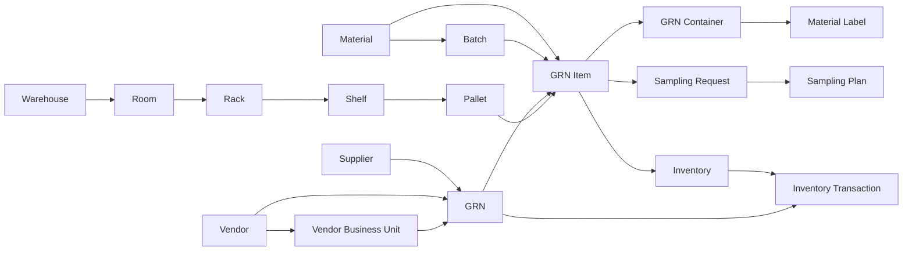
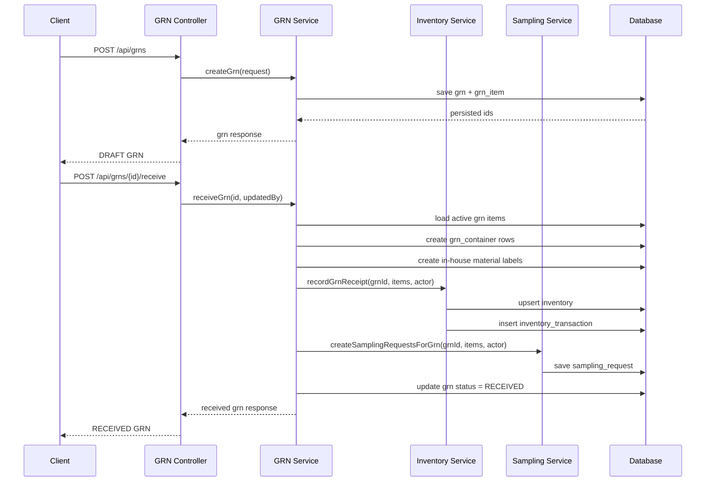
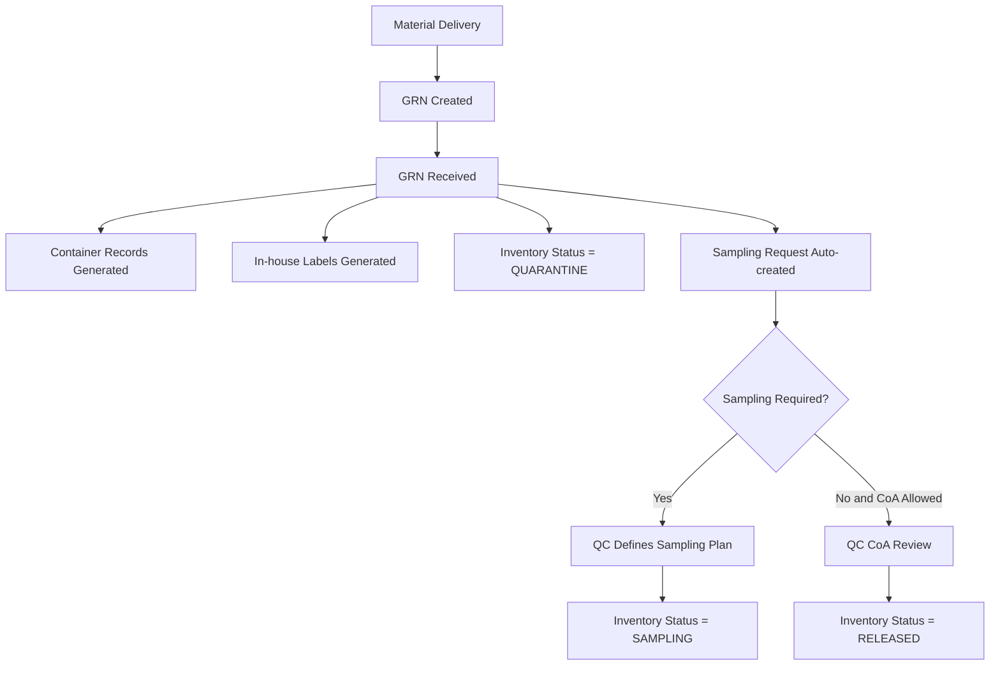

# BatchSphere Architecture

## Module View



## Warehouse Hierarchy

```text
Warehouse
  -> Room
      -> Rack
          -> Shelf
              -> Pallet
```

## Storage Condition Ownership

- `Material` defines the required storage condition.
- `Room` defines the actual storage condition of the storage area.
- `Rack`, `Shelf`, and `Pallet` inherit the room condition.
- GRN validates `material.storageCondition` against the selected pallet's room.

## Domain Flow



## Runtime Receipt Flow



## Pharma Process Flow



## Current Status Model

```text
QUARANTINE
SAMPLING
UNDER_TEST
RELEASED
REJECTED
BLOCKED
```

## Implemented Status Transitions

- `GRN receive -> QUARANTINE`
- `Sampling plan with physical sampling -> SAMPLING`
- `Sampling plan with COA_BASED_RELEASE -> RELEASED`

## Container and Label Flow

```text
GRN Item
  -> numberOfContainers
  -> quantityPerContainer
  -> containerType
  -> vendorBatch
  -> manufactureDate
  -> expiryDate
  -> retestDate
  -> palletId

On GRN receive
  -> one grn_container row per physical container
  -> internal lot generated
  -> in-house warehouse label generated
  -> container inventory status starts as QUARANTINE

On QC sampling label
  -> sampled container marked
  -> sampled quantity captured
  -> sampling location captured
  -> QC sampling label saved in label history
```

## Package Layout

```text
com.batchsphere.core
├── batch
├── config
├── exception
├── masterdata
│   ├── material
│   ├── warehouselocation
│   ├── supplier
│   ├── vendor
│   └── vendorbusinessunit
└── transcations
    ├── grn
    └── inventory
```

## Data Ownership

- `masterdata/*`: reference entities used across transactions
- `masterdata/warehouselocation`: warehouse hierarchy and room storage conditions
- `batch`: batch identity and lifecycle
- `transcations/grn`: receipt header, receipt lines, containers, and label history
- `transcations/inventory`: stock state and stock movement history
- `transcations/sampling`: sampling requests and sampling plans

## Current Inventory Integration Rule

- Only `acceptedQuantity` from a received GRN enters inventory.
- `qcStatus = PENDING` cannot be received into inventory.
- If accepted quantity is greater than zero, a `batchId` is required.
- Inventory is grouped by `materialId + batchId + palletId`.
- Selected `palletId` must belong to a room whose storage condition matches the material.

## Current Gaps

- No outbound inventory issue flow yet
- No stock adjustment API yet
- No `SAMPLING -> UNDER_TEST -> RELEASED/REJECTED/BLOCKED` action flow yet
- No sampled quantity reconciliation against GRN/container balances yet
- No auth enforcement yet
