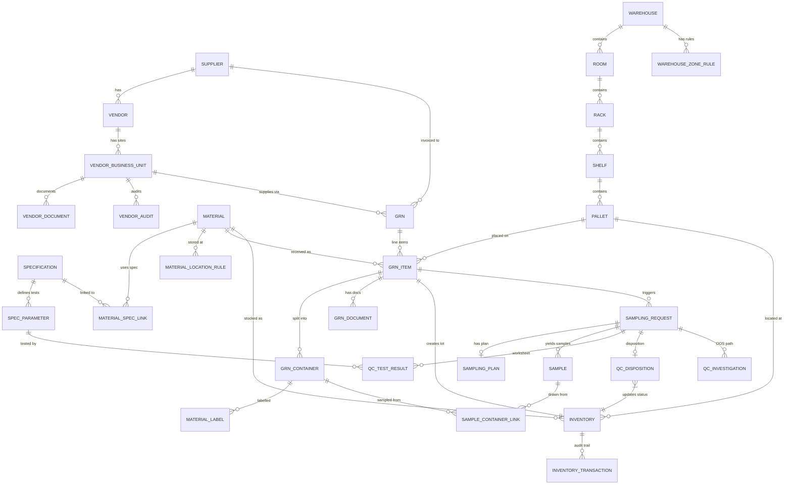
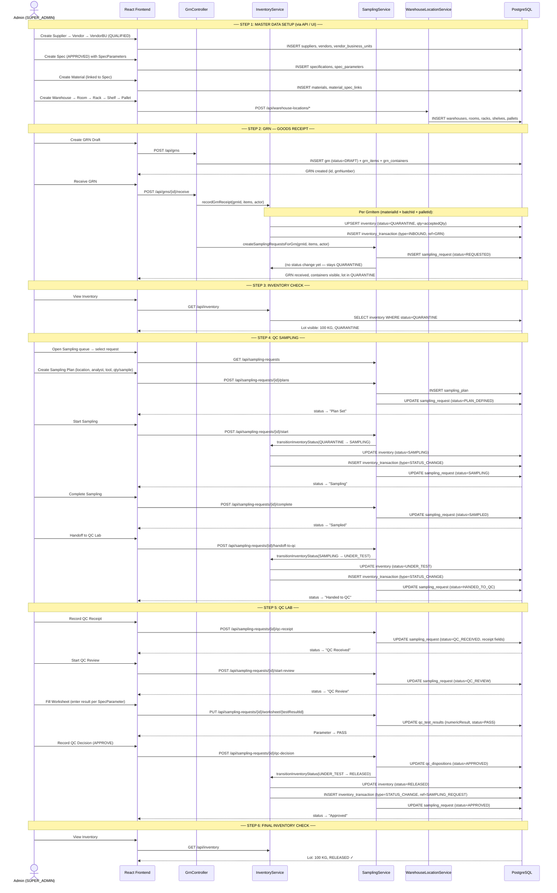
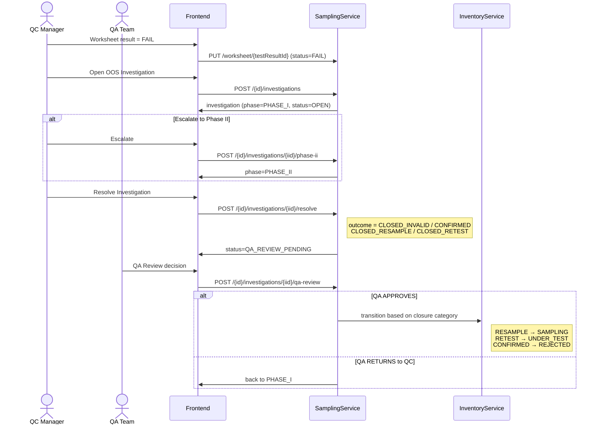

# BatchSphere — System Architecture & Integration Guide

> Generated: 2026-05-08 | Stack: Spring Boot 4 + React 18 + PostgreSQL 15

---

## Table of Contents

1. [Tech Stack](#1-tech-stack)
2. [System Layer Diagram](#2-system-layer-diagram)
3. [Module Map (Frontend → Backend → DB)](#3-module-map)
4. [Entity Relationship Diagram](#4-entity-relationship-diagram)
5. [Inventory Status State Machine](#5-inventory-status-state-machine)
6. [Happy Path — Full Sequence Diagram](#6-happy-path-full-sequence-diagram)
7. [Integration Deep-Dive: QC Sampling ↔ Inventory ↔ WMS](#7-integration-deep-dive-qc-sampling--inventory--wms)
8. [Role Access Matrix](#8-role-access-matrix)
9. [REST API Reference](#9-rest-api-reference)
10. [Database Migration Index (V1–V55)](#10-database-migration-index)

---

## 1. Tech Stack

| Layer | Technology |
|---|---|
| Backend | Spring Boot 4.0.2, Java 17, Maven |
| Database | PostgreSQL 15, Flyway V1–V55 |
| ORM | Spring Data JPA + Hibernate, Lombok |
| Auth | Spring Security + JWT (access 1h / refresh 7d) |
| Frontend | React 18, TypeScript, Vite 5 |
| Styling | TailwindCSS 3 (no component library) |
| Server State | TanStack React Query 5 |
| Client State | Zustand |
| Routing | React Router 6 (lazy-loaded pages) |
| Toasts | Sonner |
| File Storage | Local disk `core/storage/` (max 20 MB) |
| QR Codes | `com.google.zxing` |
| E2E Tests | Playwright (Chromium) |

---

## 2. System Layer Diagram

```
┌──────────────────────────────────────────────────────────────────────┐
│                     BROWSER  (port 5173)                             │
│                                                                      │
│  ┌─────────────────┐  ┌────────────────┐  ┌──────────────────────┐  │
│  │  Zustand Store   │  │  React Query   │  │  React Router 6      │  │
│  │  • authStore     │  │  (server state │  │  • Lazy pages        │  │
│  │  • appShellStore │  │   cache)       │  │  • ProtectedRoute    │  │
│  └────────┬─────────┘  └───────┬────────┘  │    role guards       │  │
│           │  JWT token          │           └──────────────────────┘  │
│           └────────────► api.ts (Bearer JWT, all fetch calls) ───────┤
└────────────────────────────────┬─────────────────────────────────────┘
                                 │ HTTP  localhost:5173 → :8080
                                 │ CORS whitelist: http://localhost:5173
                                 ▼
┌──────────────────────────────────────────────────────────────────────┐
│                  SPRING BOOT 4  (port 8080)                          │
│                                                                      │
│  ┌──────────────────────────────────────────────────────────────┐    │
│  │  Security Layer                                               │    │
│  │  JwtAuthFilter → SecurityConfig → @ControllerAdvice (errors) │    │
│  └──────────────────────────────────────────────────────────────┘    │
│                                                                      │
│  ┌──────────────────────────────────────────────────────────────┐    │
│  │  REST Controllers  (/api/*)                                   │    │
│  │  auth • users • materials • suppliers • vendors               │    │
│  │  vendor-business-units • specs • moa • sampling-tools         │    │
│  │  warehouse-locations • grns • inventory • sampling-requests   │    │
│  └───────────────────────────┬──────────────────────────────────┘    │
│                              │                                       │
│  ┌───────────────────────────▼──────────────────────────────────┐    │
│  │  Service Layer  (XxxService interface + XxxServiceImpl)       │    │
│  │  Cross-service calls:                                         │    │
│  │  GrnService → InventoryService → SamplingService              │    │
│  │  SamplingService → InventoryService  (status transitions)     │    │
│  └───────────────────────────┬──────────────────────────────────┘    │
│                              │                                       │
│  ┌───────────────────────────▼──────────────────────────────────┐    │
│  │  Repository Layer  (Spring Data JPA)                          │    │
│  │  One repo per entity, UUID primary keys                       │    │
│  └───────────────────────────┬──────────────────────────────────┘    │
│                              │                                       │
│  StorageService ──────────► core/storage/  (local disk)              │
└──────────────────────────────┬───────────────────────────────────────┘
                               │ JDBC / Hibernate
                               ▼
┌──────────────────────────────────────────────────────────────────────┐
│              PostgreSQL 15  (batchsphere_db : 5432)                  │
│              User: batchsphere_user / StrongPassword123              │
│              Flyway out-of-order, baseline-on-migrate, ~30 tables    │
└──────────────────────────────────────────────────────────────────────┘
```

---

## 3. Module Map

```
Frontend Route                 Backend Controller              DB Tables
──────────────────────────────────────────────────────────────────────────
/login                       ← POST /api/auth/login           users
                             ← POST /api/auth/refresh

/ (Dashboard)                ← GET  /api/inventory/summary    inventory
                             ← GET  /api/grns/summary         grn
                             ← GET  /api/sampling-requests/   sampling_requests
                                        summary

── MASTER DATA ───────────────────────────────────────────────────────────

/master-data/partners/
  suppliers                  ← /api/suppliers                 suppliers
  vendors                    ← /api/vendors                   vendors
  vendor-business-units      ← /api/vendor-business-units     vendor_business_units
                                                              vendor_documents
                                                              vendor_audits

/master-data/materials/
  materials                  ← /api/materials                 materials
  new                        ← POST /api/materials

/master-data/qc-refs/
  specs (tab: Specs)         ← /api/specs                     specifications
  specs (tab: MoA)           ← /api/moa                       methods_of_analysis
  specs (tab: Sampling Tools)← /api/sampling-tools            sampling_tools
                             ← /api/specs/{id}/parameters     spec_parameters
                                                              material_spec_links

/master-data/locations/
  warehouse                  ← /api/warehouse-locations/*     warehouses
                                                              rooms
                                                              racks
                                                              shelves
                                                              pallets
                                                              warehouse_zone_rules
                                                              material_location_rules

── TRANSACTIONS ──────────────────────────────────────────────────────────

/inbound/grn                 ← /api/grns                      grn
                                                              grn_items
                                                              grn_containers
                                                              material_labels
                                                              grn_documents

/inventory                   ← /api/inventory                 inventory
                             ← /api/inventory/transactions    inventory_transactions

/warehouse  (WMS view)       ← /api/warehouse-locations/*     (same as master)

/qc/sampling                 ← /api/sampling-requests         sampling_requests
                                                              sampling_plans
                                                              samples
                                                              sample_container_links
                                                              qc_test_results
                                                              qc_dispositions
                                                              qc_investigations

── ADMIN ─────────────────────────────────────────────────────────────────

/admin/users                 ← /api/users                     users
```

---

## 4. Entity Relationship Diagram



---

## 5. Inventory Status State Machine

```
                    ┌──────────────┐
                    │              │
    GRN.receive()  ▼              │
               QUARANTINE ────────┤
                    │             │
   Sampling.start() │             │
                    ▼             │
                SAMPLING          │  All transitions
                    │             │  logged as
  Sampling.handoff()│             │  InventoryTransaction
                    ▼             │
               UNDER_TEST ────────┤
                 │  │  │          │
     APPROVED ───┘  │  └─── REJECTED (terminal)
                    │
                BLOCKED ──► UNDER_TEST / SAMPLING / REJECTED

RELEASED (terminal — no further transitions allowed)

Allowed transitions (enforced in InventoryServiceImpl):

  QUARANTINE  → SAMPLING
  SAMPLING    → UNDER_TEST
  UNDER_TEST  → SAMPLING | RELEASED | REJECTED | BLOCKED
  BLOCKED     → UNDER_TEST | SAMPLING | REJECTED
  RELEASED    → (none)
  REJECTED    → (none)

Special bypass (validated explicitly):
  QUARANTINE  → RELEASED | REJECTED  (when referenceType = SAMPLING_REQUEST
                                       i.e. vendor CoA-based release)
```

---

## 6. Happy Path — Full Sequence Diagram



---

## 7. Integration Deep-Dive: QC Sampling ↔ Inventory ↔ WMS

### 7.1 How the three modules connect

```
WMS (WarehouseLocation)
  Warehouse → Room → Rack → Shelf → Pallet
       │
       │  palletId stored on GrnItem at GRN draft creation
       ▼
GRN (Goods Receipt Note)
  GrnItem { materialId, batchId, palletId, acceptedQty }
       │
       │  GrnService.receiveGrn() calls:
       │  ① InventoryService.recordGrnReceipt()
       │  ② SamplingService.createSamplingRequestsForGrn()
       ▼
Inventory
  Inventory { materialId, batchId, palletId, qty, status }
  ← keyed by (materialId + batchId + palletId)
  ← palletId = WMS location anchor (full path: Warehouse/Room/Rack/Shelf/Pallet)
       │
       │  SamplingService drives all further status transitions
       ▼
Sampling
  SamplingRequest → SamplingPlan → Samples → QcTestResults → QcDisposition
  ← every state change calls InventoryService.transitionInventoryStatus()
```

### 7.2 WMS → GRN: Location Assignment

```
Warehouse master data                   GRN Draft creation
──────────────────────                  ──────────────────────
Warehouse (warehouseCode)               User selects Pallet from
  └─ Room (roomCode)                    WMS dropdown on GrnItem form
       └─ Rack (rackCode)
            └─ Shelf (shelfCode)        palletId stored on GrnItem
                 └─ Pallet (palletCode, storageCondition=AMBIENT)

WarehouseZoneRule validates: material.storageCondition matches pallet zone
MaterialLocationRule can restrict specific materials to specific pallets
```

### 7.3 GRN Receive → Inventory Creation

```java
// GrnService.receiveGrn() calls:
inventoryService.recordGrnReceipt(grnId, items, actor);

// InventoryService creates lot keyed by (materialId + batchId + palletId):
Inventory {
  materialId    = item.getMaterialId()        // FK → materials
  batchId       = item.getBatchId()           // FK → batches
  palletId      = item.getPalletId()          // FK → pallets (WMS)
  warehouseLocation = item.getWarehouseLocation() // denorm text path
  quantityOnHand = item.getAcceptedQuantity()
  status        = QUARANTINE                  // always starts here
  uom           = item.getUom()
}

// Then records InventoryTransaction:
InventoryTransaction {
  type          = INBOUND
  referenceType = GRN
  referenceId   = grnId
  quantity      = acceptedQty
}
```

### 7.4 Sampling → Inventory Status Transitions (exact calls)

| Sampling Event | API Endpoint | Inventory Transition | Reference Type |
|---|---|---|---|
| `createSamplingRequestsForGrn` | (internal) | none (stays QUARANTINE) | — |
| `startSampling` | `POST /{id}/start` | QUARANTINE → SAMPLING | SAMPLING_REQUEST |
| `handoffToQc` | `POST /{id}/handoff-to-qc` | SAMPLING → UNDER_TEST | SAMPLING_REQUEST |
| `qcDecision` (APPROVE) | `POST /{id}/qc-decision` | UNDER_TEST → RELEASED | SAMPLING_REQUEST |
| `qcDecision` (REJECT) | `POST /{id}/qc-decision` | UNDER_TEST → REJECTED | SAMPLING_REQUEST |
| Investigation → CLOSED_RESAMPLE | (internal) | UNDER_TEST → SAMPLING | SAMPLING_REQUEST |
| Investigation → CLOSED_RETEST | (internal) | UNDER_TEST → UNDER_TEST | SAMPLING_REQUEST |
| Investigation → CLOSED_CONFIRMED | (internal) | UNDER_TEST → REJECTED | SAMPLING_REQUEST |
| Retest cycle | `POST /{id}/retest` | UNDER_TEST → UNDER_TEST | SAMPLING_REQUEST |
| Resample cycle | `POST /{id}/resample` | UNDER_TEST → SAMPLING | SAMPLING_REQUEST |

### 7.5 OOS (Out-of-Specification) Investigation Flow



### 7.6 WMS Map Interaction (Frontend)

```
WarehousePage (WMS)
  │
  ├── Left panel: Warehouse selector → Room selector → Rack selector
  │     ← GET /api/warehouse-locations/warehouses
  │     ← GET /api/warehouse-locations/rooms?warehouseId=X
  │     ← GET /api/warehouse-locations/racks?roomId=X
  │
  └── Right panel: Pallet grid for selected rack
        ← GET /api/warehouse-locations/pallets?rackId=X
        Shows: palletCode, storageCondition, occupancy
        Each pallet links to inventory lots stored there
        ← GET /api/inventory?palletId=X  (inventory by location)
```

---

## 8. Role Access Matrix

| Module | SUPER_ADMIN | WAREHOUSE_OP | QC_ANALYST | QC_MANAGER | PROCUREMENT |
|---|:---:|:---:|:---:|:---:|:---:|
| Dashboard | ✓ | ✓ | ✓ | ✓ | ✓ |
| GRN (Inbound) | ✓ | ✓ | — | — | — |
| Inventory | ✓ | ✓ | — | — | — |
| Warehouse / WMS | ✓ | ✓ | — | — | — |
| QC Sampling | ✓ | — | ✓ | ✓ | — |
| Materials (view + create) | ✓ | ✓ | ✓ | ✓ | view only |
| Partners (Supplier/Vendor/BU) | ✓ | — | — | — | ✓ |
| Specs / MoA / Sampling Tools | ✓ | — | ✓ | ✓ | ✓ |
| User Management | ✓ | — | — | — | — |

**Seeded users:**

| Username | Password | Role |
|---|---|---|
| admin | Admin@123 | SUPER_ADMIN |
| qc.analyst | Admin@123 | QC_ANALYST |
| qc.manager | Admin@123 | QC_MANAGER |
| warehouse.op | Admin@123 | WAREHOUSE_OP |
| procurement.user | Admin@123 | PROCUREMENT |

---

## 9. REST API Reference

### Auth
| Method | Path | Description |
|---|---|---|
| POST | `/api/auth/login` | Login, returns access + refresh tokens |
| POST | `/api/auth/refresh` | Refresh access token |
| POST | `/api/auth/logout` | Invalidate refresh token |

### Master Data — Materials
| Method | Path | Description |
|---|---|---|
| GET | `/api/materials` | List all materials |
| POST | `/api/materials` | Create material |
| GET | `/api/materials/{id}` | Get by ID |
| PUT | `/api/materials/{id}` | Update material |

### Master Data — Partners
| Method | Path | Description |
|---|---|---|
| GET/POST | `/api/suppliers` | List / create suppliers |
| GET/PUT | `/api/suppliers/{id}` | Get / update supplier |
| GET/POST | `/api/vendors` | List / create vendors |
| GET/PUT | `/api/vendors/{id}` | Get / update vendor |
| GET/POST | `/api/vendor-business-units` | List / create vendor BUs |
| PUT | `/api/vendor-business-units/{id}` | Update BU |
| POST | `/api/vendor-business-units/{id}/qualify` | Qualify BU |
| POST | `/api/vendor-business-units/{id}/documents` | Upload document |
| GET/POST | `/api/vendor-business-units/{id}/audits` | List / add audit |
| PUT | `/api/vendor-business-units/{id}/audits/{aid}` | Edit audit |

### Master Data — QC Refs
| Method | Path | Description |
|---|---|---|
| GET/POST | `/api/specs` | List / create specs |
| PUT | `/api/specs/{id}/status` | Lifecycle transition |
| GET/POST | `/api/specs/{id}/parameters` | Parameters CRUD |
| GET/POST | `/api/moa` | List / create MoA |
| GET/POST | `/api/sampling-tools` | List / create tools |

### Master Data — Warehouse (WMS)
| Method | Path | Description |
|---|---|---|
| GET/POST | `/api/warehouse-locations/warehouses` | Warehouses |
| GET/POST | `/api/warehouse-locations/rooms` | Rooms |
| GET/POST | `/api/warehouse-locations/racks` | Racks |
| GET/POST | `/api/warehouse-locations/shelves` | Shelves |
| GET/POST | `/api/warehouse-locations/pallets` | Pallets |
| GET/POST | `/api/warehouse-locations/zone-rules` | Zone rules |
| GET/POST | `/api/warehouse-locations/material-location-rules` | Material rules |

### Transactions — GRN
| Method | Path | Description |
|---|---|---|
| POST | `/api/grns` | Create GRN draft |
| GET | `/api/grns` | List GRNs |
| GET | `/api/grns/summary` | Dashboard summary |
| GET | `/api/grns/{id}` | Get GRN detail |
| PUT | `/api/grns/{id}` | Update GRN draft |
| POST | `/api/grns/{id}/receive` | **Receive GRN** → triggers inventory + sampling |
| POST | `/api/grns/{id}/cancel` | Cancel GRN |
| DELETE | `/api/grns/{id}` | Delete draft |
| GET | `/api/grns/items/{grnItemId}/containers` | Get containers |
| GET | `/api/grns/{id}/labels` | Get labels |
| GET | `/api/grns/{id}/labels/print-data` | QR print data |
| POST | `/api/grns/containers/{cid}/sampling-label` | Apply sampling label |
| POST | `/api/grns/items/{grnItemId}/documents` | Upload document |

### Transactions — Inventory
| Method | Path | Description |
|---|---|---|
| GET | `/api/inventory` | List all lots |
| GET | `/api/inventory/summary` | Dashboard summary |
| GET | `/api/inventory/{id}` | Get lot detail |
| PUT | `/api/inventory/{id}/status` | Manual status update |
| POST | `/api/inventory/{id}/adjust` | Quantity adjustment |
| POST | `/api/inventory/{id}/issue` | Issue material |
| POST | `/api/inventory/{id}/transfer` | Transfer to another pallet |
| GET | `/api/inventory/transactions` | Full audit trail |

### Transactions — QC Sampling
| Method | Path | Description |
|---|---|---|
| GET | `/api/sampling-requests` | Queue list |
| GET | `/api/sampling-requests/summary` | Dashboard summary |
| GET | `/api/sampling-requests/{id}` | Get request detail |
| GET | `/api/sampling-requests/{id}/cycles` | Retest/resample lineage |
| POST | `/api/sampling-requests/{id}/plans` | Create sampling plan |
| PUT | `/api/sampling-requests/{id}/plans/{pid}` | Update plan |
| POST | `/api/sampling-requests/{id}/start` | **Start sampling** → Inventory QUARANTINE→SAMPLING |
| POST | `/api/sampling-requests/{id}/complete` | Complete sampling |
| POST | `/api/sampling-requests/{id}/handoff-to-qc` | **Handoff** → Inventory SAMPLING→UNDER_TEST |
| POST | `/api/sampling-requests/{id}/qc-receipt` | Record QC receipt |
| POST | `/api/sampling-requests/{id}/start-review` | Start QC review |
| GET | `/api/sampling-requests/{id}/worksheet` | Get worksheet |
| PUT | `/api/sampling-requests/{id}/worksheet/{tid}` | Save test result |
| POST | `/api/sampling-requests/{id}/qc-decision` | **QC Decision** → Inventory UNDER_TEST→RELEASED/REJECTED |
| GET/POST | `/api/sampling-requests/{id}/investigations` | OOS investigation |
| POST | `…/investigations/{iid}/phase-ii` | Escalate |
| POST | `…/investigations/{iid}/resolve` | Resolve |
| POST | `…/investigations/{iid}/qa-review` | QA review |
| POST | `/api/sampling-requests/{id}/retest` | Create retest cycle |
| POST | `/api/sampling-requests/{id}/resample` | Create resample cycle |
| POST | `/api/sampling-requests/{id}/retained-sample/destroy` | Destroy retained sample |

---

## 10. Database Migration Index

| Version | Table / Change |
|---|---|
| V1 | `users` — auth foundation |
| V2 | `materials` — material master |
| V3 | `suppliers` |
| V4 | `vendors` |
| V5 | `vendor_business_units` |
| V6 | UoM + description on materials |
| V7 | `grn`, `grn_items`, `grn_containers` |
| V8 | `inventory`, `inventory_transactions` |
| V9 | Storage condition on material |
| V10–V15 | Warehouse hierarchy (warehouses, rooms, racks, shelves, pallets) |
| V16–V20 | VMS enhancements (audits, documents, qualification status) |
| V21–V25 | GRN enhancements (labels, QR codes, documents) |
| V26–V30 | Spec + MoA (`specifications`, `methods_of_analysis`) |
| V31–V35 | Sampling tools, initial sampling request tables |
| V36–V40 | Sampling plan, samples, container links |
| V41 | Sampling request status lifecycle expansion |
| V42 | `spec_parameters`, `material_spec_links` |
| V43 | Spec revision chain (parentSpecId, revisionNumber) |
| V44 | `qc_test_results`, QC receipt fields on sampling_request |
| V45 | Retained sample fields |
| V46 | `qc_investigations` table |
| V47 | Sampling request lineage (parentSamplingRequestId, rootSamplingRequestId, cycleNumber) |
| V48 | QC sample lifecycle flags |
| V49 | QC investigation structure enhancements |
| V50 | QA review fields on investigation |
| V51 | Investigation audit fields (assignedTo, reviewedBy, timestamps) |
| V52 | Full compliance fields on investigation |
| V53 | `closureCategory` on investigation |
| V54 | Material master expanded attributes |
| V55 | Inventory issue and audit enhancements |

---

## Planned Modules (Not Yet Built)

| Module | Status |
|---|---|
| HRMS (HR Management System) | Planned |
| LIMS (Lab Info beyond sampling) | Planned |
| QMS (Deviations, CAPAs) | Planned |
| Batch Manufacturing | Planned |
| Internal Business Units (UI) | Backend exists, no frontend |
| Batch entity (UI) | Backend exists, no frontend |
